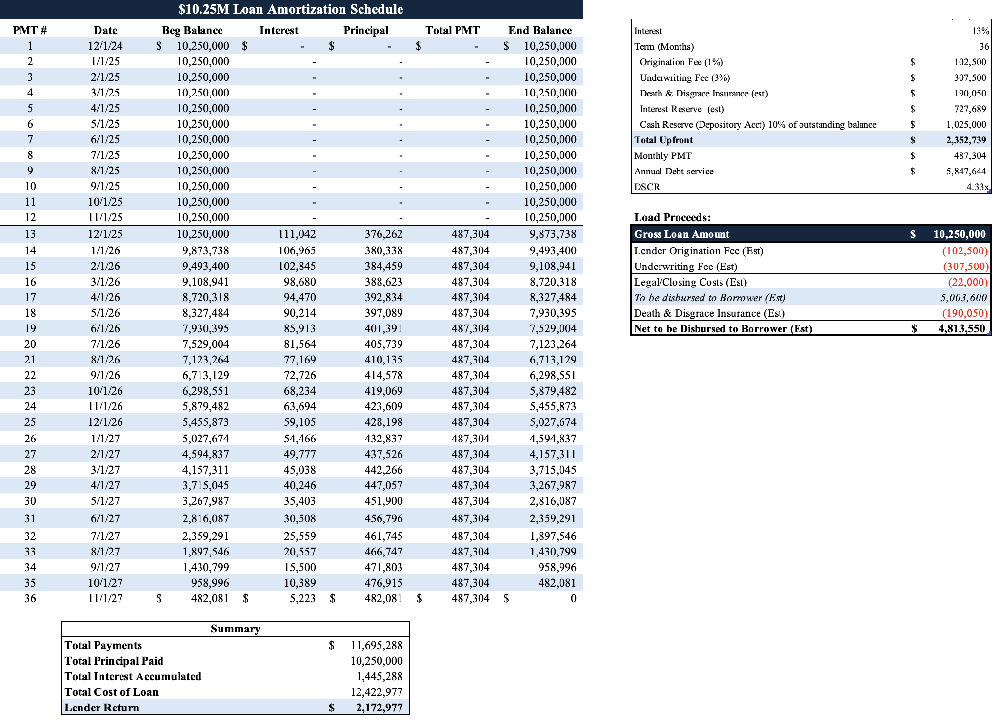
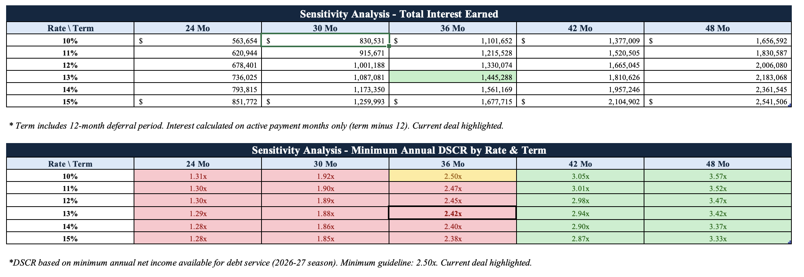
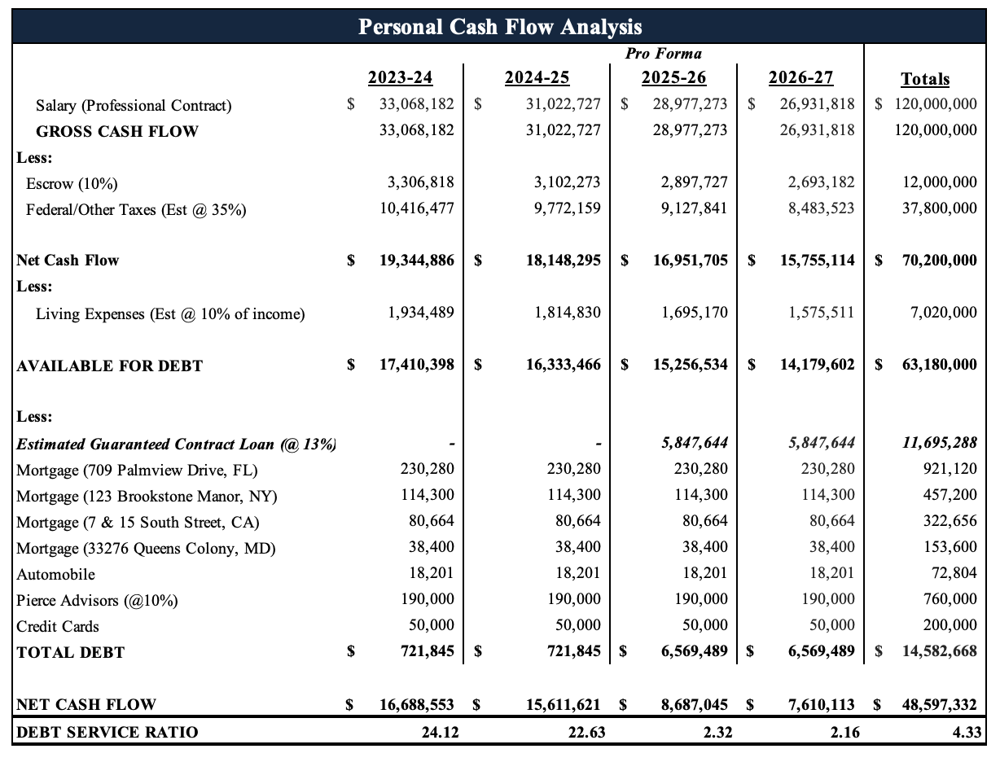
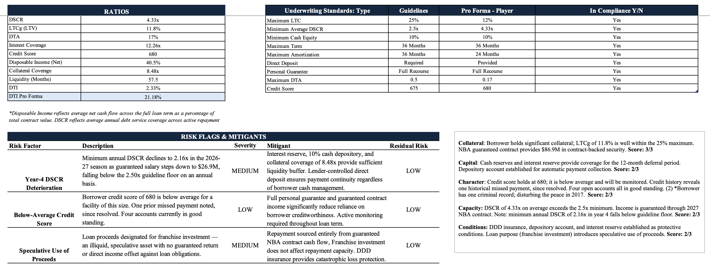
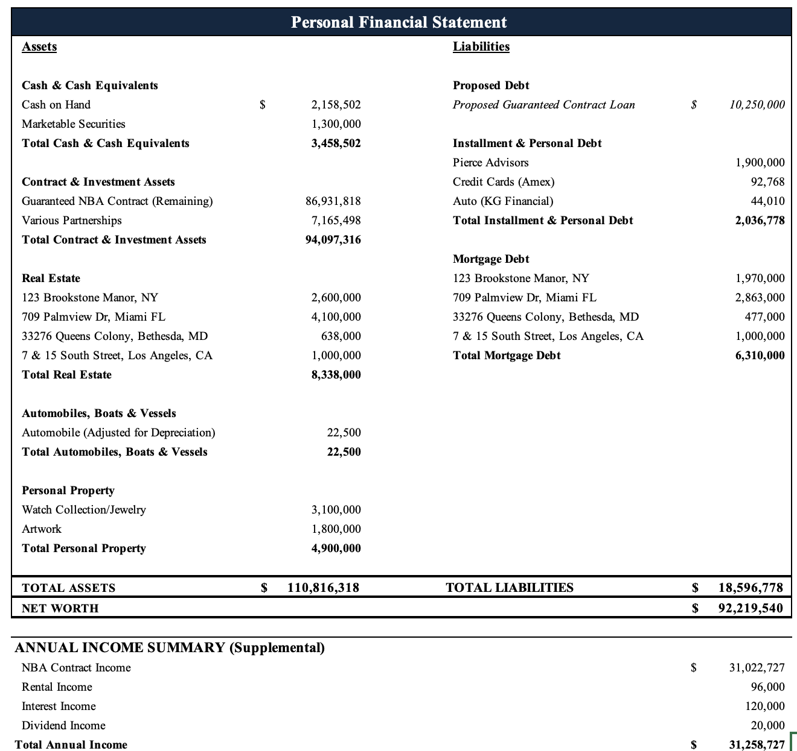

# Private Credit Contract Facility Analysis Model

## Overview
This model evaluates specialty loans secured by guaranteed contracts, structured as a 36-month facility with a 12-month deferral period followed by 24 months of principal and interest payments. The analysis covers the full underwriting lifecycle from initial credit assessment through approval recommendation.

## Key Features

```python
- Comprehensive credit assessment
- Dual sensitivity analysis: 30 stress-test scenarios
- 36-month amortization schedule with 12-month deferral
- Underwriting standards compliance framework
- Risk identification and mitigation strategy
- Personal financial statement construction
- 5 C's credit assessment (Character, Capacity, Capital, Collateral, Conditions)
```
## Model Components

### Financial Models

* Amortization schedule: 36-month term with 12-month deferral period

```python
Deferral Period: 12 months (0 payments)
Repayment Period: 24 months (principal + interest)
Total Term: 36 months
```


* Sensitivity analysis: 30 scenarios

```python
Stress Test Variables:
Interest Rate Range: 5% – 12%
Term Range: 24 – 36 months
Output: Minimum Annual DSCR, Total Interest Income
```



* Four-year cash flow analysis

```python
Net Cash Flow = Guaranteed Salary - Documented Expenses
Available for Debt Service = Net Cash Flow (annual)
```


* Interest Reserve & Fees

```python
Interest Reserve = 1% of Loan Amount (funded upfront)
Origination Fee = 3% of Loan Amount
Documentation Fee = 10% of Loan Amount
Total Fees = Interest Reserve + Origination Fee + Documentation Fee
```

 
* Personal financial statement (PFS)
  * Balance sheet of liquid and non-liquid assets
 
 

### Credit Analysis
- Debt Service Coverage (DSCR) 
```python
DSCR = Annual Net Cash Flow / Annual Debt Service
```
* Monthly Payment Calculation (PMT)

```python
Monthly Payment = PMT(monthly_rate, number_of_months, -loan_amount)
Total Interest = (Monthly Payment × Term) - Loan Amount
```

* Amortization

```python
Beginning Balance = Prior Month Ending Balance
Interest Payment = Beginning Balance × Monthly Rate
Principal Payment = Monthly Payment - Interest Payment
Ending Balance = Beginning Balance - Principal Payment
```
- Loan-to-Contract (LTCg) 
```python
LTCg = Loan Amount / Remaining Guaranteed Salary
```
- Debt-to-Asset (DTA) 
```python
DTA = Total Liabilities / Total Assets
```
- Debt-to-Income (DTI) 
```python
DTI = Monthly Debt Obligation / Monthly Income
```
- Interest coverage 
```python
Interest Coverage = Annual Net Cash Flow / Annual Interest Expense
```
- Liquidity and collateral coverage (Liquidity buffer: months of available cash relative to monthly debt service)
```python
Collateral Coverage = Remaining Guaranteed Salary / Loan Amount
Liquidity = Liquid Assets / Monthly Debt Service
```

### Credit Documentation

* Underwriting standards compliance table
  * Ratio calculations, guideline thresholds, pro forma results, compliance flags

* Risk assessment with mitigants
  * Risks identified with severity ratings and lender mitigants

* Approval recommendation with supporting rationale
  * Credit decision backed by quantitative analysis and qualitative risk assessment

## File Structure

#### PC_Analysis_Model.xlsx

1. NBA CONTRACT LOAN (Model overview & navigation guide)
2. Summary  (Credit memorandum & approval decision)
3. Guidelines        (Ratio compliance, risk flags, 5 C's framework)
4. Cash Flow         (4-year income & expense analysis)
5. Schedule          (36-month amortization with deferral)
6. Sensitivity       (30-scenario rate/term stress test)
7. Inputs            (Centralized deal parameters)
8. PFS               (Personal financial statement)
9. Contract          (Compensation analysis)

| Metric | Value |
|---|---|
| Loan Amount | $10,250,000 |
| Interest Rate | 13.0% |
| Term | 36 months (12-month deferral + 24-month amortization) |
| Monthly PMT | $487,304 |
| Annual Debt Service | $5,847,644 |
| Average DSCR | 4.33x |
| Minimum Annual DSCR | 2.16x (Year 4) |
| LTCg | 11.8% |
| Collateral Coverage | 8.48x |
| Net Worth | $90.7M |
| Total Upfront | $2,352,739 |
| Total Lender Return | $2,172,978 |


**Tools**
- Microsoft Excel: dynamic formulas, named ranges, conditional formatting, data validation, PivotTables

## Disclaimer

*Sample deal for demonstration purposes only. All data is fictional. Prepared independently by Kristen Gallagher.*

## License

© 2025 Kristen Gallagher. All rights reserved. This work is made available for viewing and reference purposes only. You may not reproduce, distribute, modify, or claim this work as your own without explicit written permission from the author.
